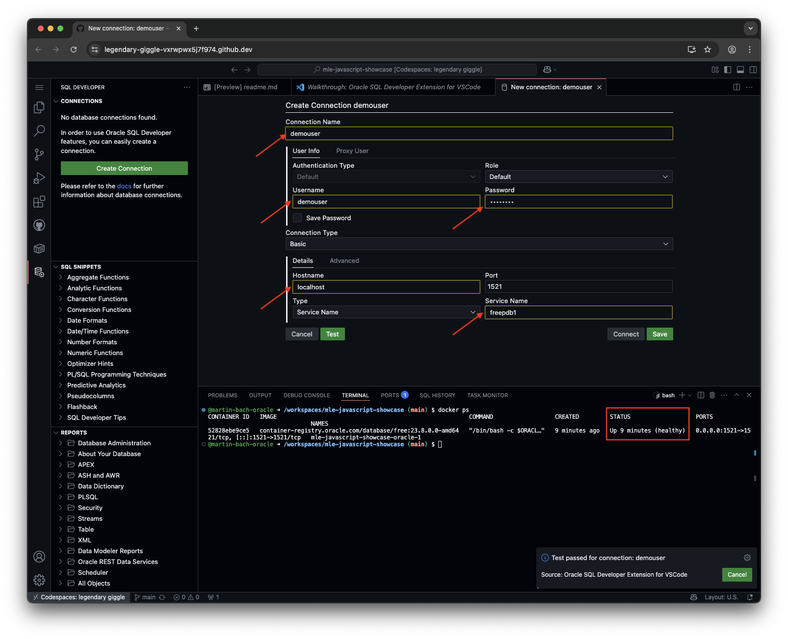

# MLE JavaScript Showcase

Oracle Database 23ai introduces [In-Database JavaScript](https://docs.oracle.com/en/database/oracle/oracle-database/23/mlejs/) for Linux x86-64 and aarch64. That’s Linux on Intel and Arm, respectively. Developers with a preference for Typescript can use it alternatively after transpilation to JavaScript. JavaScript support in Oracle Database is known as **Multilingual Engine**, or MLE for short.

This project is intended to be run via GitHub codespaces and showcase MLE/JavaScript features in a simple-to-set up environment. Alternatively you can spin up a container instance based on a compose file.

Examples include:

- Writing JavaScript procedures and functions in-line with a PL/SQL header
- Dynamic MLE code execution based on `DBMS_MLE`
- Creating JavaScript modules and environments
- Use of Typescript with MLE
- Accessing the database using a NoSQL API named [SODA](https://docs.oracle.com/en/database/oracle/simple-oracle-document-access/adsdi/index.html)

## Usage

You can use this repository in 2 ways:

- Directly within GitHub Codespaces
- Locally

Both are discussed in turn.

### GitHub Codespaces

The repository contains instructions in `.devcontainer/devcontainer.json` creating a development environment in GitHub Codespaces. It might take a minute or 2 to create, please be patient. As part of the Codespace initialisation a database will be set up including a demo account, `demouser`, password `demouser`, in `freepdb1` using `docker-compose`. Update the compose file to the latest database release as per <https://container-registry.oracle.com/ords/ocr/ba/database/free> if needed.

Since VSCode is the default development environment in Codespaces it is only logical to link [SQLDeveloper Extension for VSCode](https://marketplace.visualstudio.com/items?itemName=Oracle.sql-developer) into the IDE. Create a new connection in the SQLDev extension and run the scripts as you like and see fit. Connect as `demouser/demouser` to freepdb1 on `localhost`.



### Local deployment

You need either Docker or Podman installed and available on your machine. Clone the repository using the standard commands and create the sample database using `01_setup/database.sh`. Update the script to the latest database release as per <https://container-registry.oracle.com/ords/ocr/ba/database/free> if needed.

As part of the database initialisation you get a new user account in `freepdb1`, named `demouser`. It will be used for all the demo scripts. Using your favourite tool, ideally SQLDeveloper Extension for VSCode, to connect to the database and run the scripts in a worksheet.

## Example Scripts

All scripts are to be run as `demouser` on `freepdb1`; ideally using VSCode and [SQLDeveloper Extension for VSCode](https://marketplace.visualstudio.com/items?itemName=Oracle.sql-developer)

You'll find **basic examples** in `02_basic_examples`:

- [Inline JavaScript](https://docs.oracle.com/en/database/oracle/oracle-database/23/mlejs/call-specifications-functions.html) functions and procedures
- Examples how to invoke these
- [MLE Modules](https://docs.oracle.com/en/database/oracle/oracle-database/23/mlejs/using-javascript-modules-mle.html)
- [MLE environments](https://docs.oracle.com/en/database/oracle/oracle-database/23/mlejs/specifying-environments-mle-modules.html)
- Examples how to expose JavaScript to SQL and PL/SQL
- Dynamic JavaScript execution

You can find more advanced examples how to write, test, and transpile **Typescript** to In-Database JavaScript in `03_typescript`.

The final set of examples concerns the **NoSQL-style API** named [SODA](https://docs.oracle.com/en/database/oracle/oracle-database/23/mlejs/soda-collections-in-mle-js.html). Simple Oracle Document Access (SODA) is a set of NoSQL-style APIs that let you create and store collections of documents (in particular JSON) in Oracle Database, retrieve them, and query them, without needing to know Structured Query Language (SQL) or how the documents are stored in the database.

## Troubleshooting

Codespaces are useful because they _should_ provide you with a running database and IDE in little to no time. Sometimes however a little extra work is needed if things didn't go to plan.

In theory the  Codespace's `postCreateCommand` - `docker compose up -d` should pull the database image automatically and start it with the listener port exposed to port 1521. In case your connection to the database cannot be established, check if the compose file ran successfully:

```
@martin-bach-oracle ➜ /workspaces/mle-javascript-showcase (main) $ docker compose ps
NAME                               IMAGE                                                        COMMAND                  SERVICE   CREATED          STATUS                    PORTS
mle-javascript-showcase-oracle-1   container-registry.oracle.com/database/free:23.8.0.0-amd64   "/bin/bash -c $ORACL…"   oracle    19 minutes ago   Up 19 minutes (healthy)   0.0.0.0:1521->1521/tcp, [::]:1521->1521/tcp
@martin-bach-oracle ➜ /workspaces/mle-javascript-showcase (main) $
```

If you don't see any output, manually (re-)start the database using a terminal:

```
docker compose up -d
```

You can view the progress using `docker compose logs`.
